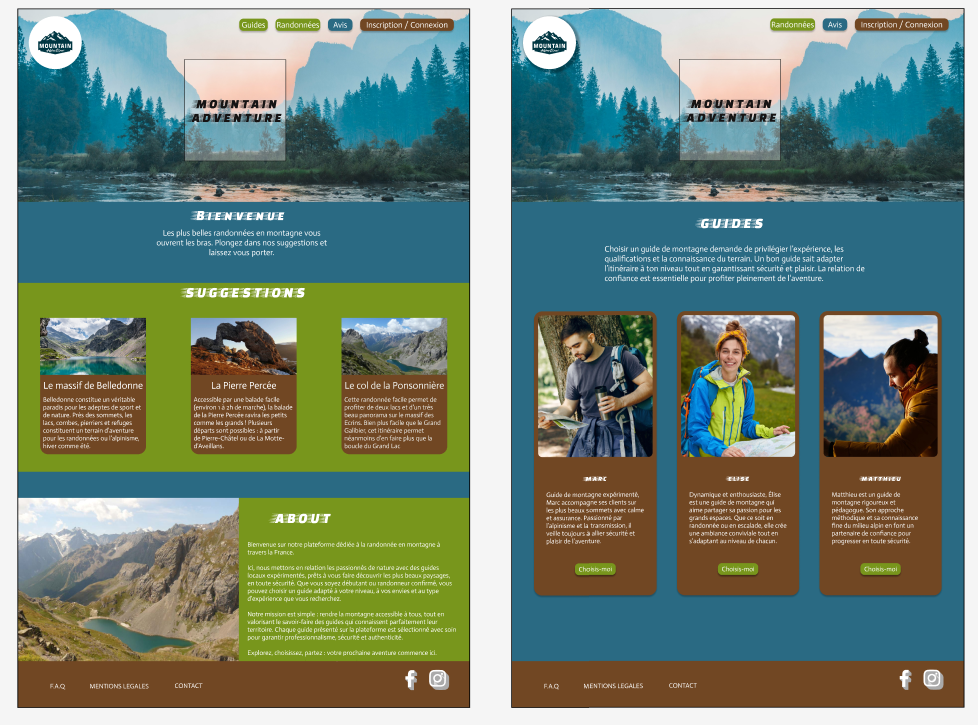

# 📄 Cahier des Charges - Site web de randonnées en montagne

## 1. **Introduction**
### 1.1 Contexte
L’entreprise **Mountain Adventure** souhaite mettre en place un système simple et efficace pour la **réservation de randonnées en montagne**
### 1.2 Objectifs
- Réservation en ligne de randonnées en montagne
- Site web responsive et sécurisé
- Gestion d'une base de données de clients, guides et lieux de randonnées
- Expérience utilisateur intuitive

### 1.3 Périmètre
- *Inclus* : 
 Choix de la randonnées et du guide, inscription, réservation, mettre un avis.
- *Exclu* : 
La réservation du trajet jusqu'au lieu de la randonnées (voiture, bus, vol, train). (Mais possible dans l'évolution de l'appli).

---

## 2. **Organisation du Développement**
### 2.1 Méthodologie
 Organisation du projet avec la méthode MoSCoW sur Jira.

### 2.2 Phases 
| Phase | Description 
|-------|-------------|
| 1 | Création de la maquette et dictionnaire de données (MCD, MLD)  
| 2 | Backend : Création de la base de données (CRUD) 
| 3 | Frontend : Création des pages 
| 4 | Tests et corrections 
| 5 | Mise en ligne 

---

## 3. **Spécifications Fonctionnelles**
### 3.1 Modules
- **3.1.1 Accueil** : 
Page d'accueil sur laquelle se trouvera un HeroHeader, une section suggestions de randonnées, une section About.
- **3.1.2 Guides** :
Page sur laquelle se trouvera la présentation des guides de randonnées. 
- **3.1.3 Randonnées** :
Page sur laquelle on trouvera les différentes randonnées de montagne disponibles.
- **3.1.4 Avis** : 
Page sur laquelle on retrouvera les avis des clients ayant déjà fait l'expérience des randonnées.
- **3.1.5 Connexion / Inscription** : 
Page sur laquelle les visiteurs pourront s'inscrire et se connecter via un formulaire afin d'accéder à la réservation.
- **3.1.6 Réservation** : 
Page sur laquelle se trouvera le récapitulatif de la réservation du client.
- **3.1.7 DashBoard Admin** :
Page sur laquelle les administrateurs pourront gérer les clients, les réservations, les guides et randonnées.
- **3.1.8 Navbar et Footer** :
Sur chaque page se trouvera une barre de navigation pour aller sur chaque page et un footer sur lequel se trouvera les informations légales.

### 3.2 Workflow

- **3.2.1 Workflow des administateurs** :

**Connexion → Gestion du contenu → Validation des réservations**

L'administrateur se connecte et peut gérer les demandes de réservation, créer des randonnées et des nouveaux guides via le dashboard.

- **3.2.2 Workflow des utilisateurs**

**Connexion → Accès aux réservation → Poster un avis**

Le client, une fois connecté, pourra accèder aux réservations et pourra aussi poster un avis.

---

## 4. **Spécifications Techniques**
- **Front-end** : React.
- **Back-end** : NodeJS.
- **Base de données** : MySQL.
- **Sécurité** : Bcrypt, JTW
- **Performance** : Temps de réponse < 2s.

---

## 5. **Base de Données**
### Tables principales :
**User** = (  
    user_id INT PK,  
    last_name VARCHAR(255),  
    first_name VARCHAR(255),  
    role ENUM('client','admin'),  
    tel VARCHAR(10),  
    mail VARCHAR(255),  
    password VARCHAR(255),  
    registration_date DATE,  
    is_active BOOLEAN  
);  

**Hike** = (  
    hike_id INT PK,  
    image VARCHAR(255),  
    title VARCHAR(255),  
    description TEXT,  
    duration INT,  
    level ENUM('easy','medium','hard'),  
    max_participants INT,  
    price DECIMAL(10,2),  
    location VARCHAR(255),  
    is_active BOOLEAN  
);

**Guide** = (  
    guide_id INT PK,  
    last_name VARCHAR(255),  
    first_name VARCHAR(255),  
    bio TEXT,  
    is_active BOOLEAN  
);

**Booking** = (  
    booking_id INT PK,  
    booking_date DATE,  
    number_participants INT,  
    status ENUM('pending','confirmed','cancelled'),  
    #guide_id*,  
    #hike_id*,  
    #user_id*  
);

**Payment** = (  
    payment_id INT PK,  
    amount DECIMAL(15,2),  
    payment_method ENUM('card','paypal'),  
    status ENUM('pending','confirmed','cancelled'),  
    #booking_id*  
);

**Review** = (  
    review_id INT PK,  
    commentary TEXT,  
    rating INT,  
    created_at DATETIME,  
    #hike_id*,  
    #user_id*  
);

**GuideAvailability** = (  
    availability_id INT PK,  
    available_date DATE,  
    #guide_id*  
);

---

## 6. **Interfaces & Design**
### 6.1 Charte graphique
- Couleur dominante : #2A6A83 BLEU
- Couleur secondaire : #714723 MARRON
- Couleur tertiaire : #78961C VERT
- Police principale : Actor Regular
- Police secondaire : Faster One Regular

### 6.2 Pages principales
- Accueil
- Randonnées
- Guides
- Avis
- Réservation
- Connexion / Inscription
- Dashboard

---

## 7. **Paramétrages & Droits Utilisateurs**
| Rôle | Droits |
|------|--------|
| Admin | ajouter et supprimer guides et randonnées, valider les réservations, accès au dashboard |
| User | parcourir les pages, faire des réservations et poster des commentaires |

---

## 8. **Livrables & Tests**
- **Livrables** : Code source, documentation technique, manuel utilisateur.
- **Tests** : Unitaires (Jest), Fonctionnels (Cypress), Recette utilisateur.

---

## 9. **Maintenance & Évolutions**
- Maintenance corrective : si besoin.
- Évolutions prévues : réservation de transports pour accèder au lieu des randonnées.

---

## 10. **Annexes**

